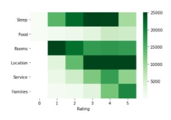

# Determine-Hotels-most-important-evaluation-criteria
Use topic modeling applied to very large amount of hotel reviews to determine key evaluation criteria of hotel customers

In this project, over 1.5 millions hotel reviews are analyzed to identify the most important criteria determining good hotels vs. bad hotels.

Latent Dirichlet Allocation is used to identify general topics covered in the reviews. I then use these categories to identify the key differencies between good and bad hotels.
LDA is an unsupervised machine learning technique which I cover in details in a previous project [here](https://github.com/LaurentVeyssier/Topic-Modeling-and-Document-Categorization-using-Latent-Dirichlet-Allocation).

The dataset used comes from EDX and can be found [here](https://courses.edx.org/courses/course-v1:UCx+LNG01.2ucx+3T2020/course/).

# Results

- The quality of the room / accomodation is the most important driver for bad reviews => Bad hotels are defined by their rooms.
- The location of the hotel is the most important driver for good reviews => Great hotels are defined by their location.

